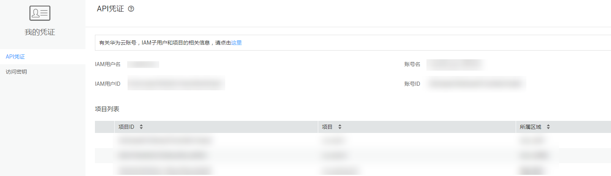

# CLI概述<a name="zh-cn_topic_0070637155"></a>

命令行接口采用[OpenStackClient](https://docs.openstack.org/developer/python-openstackclient/)工具。该工具提供命令行客户端，通过执行命令即可访问云服务的API获取云服务，操作方便。

## 命令行客户端概述<a name="section55023063"></a>

OpenStackClient项目设有统一命令行客户端（Unified CLI），通过执行命令即可访问OpenStack项目的API，操作非常简单。并且，大多数OpenStack项目会为每一项服务设置一个命令行客户端（Individual CLI）。例如，Compute服务提供的是Nova命令行客户端。具体信息请参见[详情](https://docs.openstack.org/user-guide/common/cli-overview.html)。

## 安装<a name="section25445523"></a>

**工具安装说明**

[OpenStackClient](https://docs.openstack.org/developer/python-openstackclient/)可以通过安装运行python-openstackclient插件使用。因此，在使用该工具之前，需要确保python-openstackclient正常。

只要保证Python运行正常，该工具可以在所有操作系统上运行。但是由于各种操作系统之间存在差异，所以操作方法不尽相同。推荐使用Ubuntu16.04\(64bit\)操作系统。以下操作都以Ubuntu16.04\(64bit\)为例。

安装过程请在**root**权限下进行。

1.  **更新系统**

    执行如下命令：

    **apt-get update**

    **apt-get upgrade**

2.  **安装Python**

    根据OS类型安装 Python和pip。支持Python 2.7版本。

    Ubuntu 16.04一般包含 Python 2.7。若尚未安装Python，请按照下面步骤安装。

    执行以下命令安装python：

    **apt-get install python**

    执行以下命令安装setuptools：

    **apt-get install python-setuptools**

    执行以下命令安装pip：

    **apt-get install python-pip**

    （如果Ubuntu支持的setuptools和pip版本比较低，用户可以采用离线的方式安装。）

    执行以下命令安装dev：

    **apt-get install python-dev**

3.  **安装 python-openstackclient以及依赖的组件**

    默认支持以下版本：

    -   python-openstackclient: 3.2.1
    -   python-novaclient: 6.0.2
    -   python-glanceclient: 2.5.0
    -   python-keystoneclient: 3.5.1
    -   python-neutronclient: 6.0.1
    -   python-cinderclient: 1.9.0
    -   python-heatclient: 1.5.1
    -   python-designateclient: 2.3.0
    -   openstacksdk: 0.9.5
    -   cliff：2.2.0
    -   os-client-config：1.21.1
    -   osc-lib：1.1.0
    -   通过执行以下命令，使用pip安装python-openstackclient：

        **pip install python-openstackclient==3.2.1**

        安装完成之后，请在命令行中输入如下命令，验证python-openstackclient能否正常运行。

        **openstack -h**

        查看是否显示帮助信息。如有帮助信息，表示安装成功。

        其他部件安装方法相同。请使用相同的命令，按顺序进行安装。


## 配置<a name="section34289837163733"></a>

1.  配置OpenStack Client

    既可以使用**root**用户，也可以以普通用户身份进行配置。

    > **须知：**   
    >只能通过安全网络（例如，通过VPN或租户弹性云服务器）调用API。如果网络不安全，则可能会受到攻击。  

    1.  在OpenStack客户端安装路径下，创建一个环境变量文件，例如**novarc**。
    2.  使用文本编辑器创建环境变量文件，然后输入用户名、密码、区域、IAM IP地址和端口。

        示例如下：

        ```
        export OS_USERNAME="user_name" //登录控制台所用的用户名
        export OS_USER_DOMAIN_NAME=user_domain_name //登录控制台所用的账号名
        export OS_PASSWORD=password //登录控制台所用的密码
        # Only change these for a different region 
        export OS_TENANT_NAME=tenant_name//项目名称
        export OS_PROJECT_NAME=tenant_name//项目名称
        export OS_AUTH_URL=https://iam.example.com:443/v3 
        export OS_INTERFACE=public
        export NOVA_ENDPOINT_TYPE=publicURL 
        export OS_ENDPOINT_TYPE=publicURL 
        export CINDER_ENDPOINT_TYPE=publicURL 
        export OS_VOLUME_API_VERSION=2 
        export OS_IDENTITY_API_VERSION=3 
        export OS_IMAGE_API_VERSION=2
        ```

        用户名、账号名、项目名称等在我的凭证中可获取，请参考[图1](#fig1219132543513)获取。其他环境变量说明请参见[表1](#table22746728)。

        **图 1**  账号相关参数<a name="fig1219132543513"></a>  
        

        

        

        

        **表 1**  环境变量说明

        <a name="table22746728"></a>
        <table><thead align="left"><tr id="row54770906"><th class="cellrowborder" valign="top" width="31.94%" id="mcps1.2.3.1.1"><p id="p7258393"><a name="p7258393"></a><a name="p7258393"></a>参数</p>
        </th>
        <th class="cellrowborder" valign="top" width="68.06%" id="mcps1.2.3.1.2"><p id="p51058985"><a name="p51058985"></a><a name="p51058985"></a>说明</p>
        </th>
        </tr>
        </thead>
        <tbody><tr id="row6847548"><td class="cellrowborder" valign="top" width="31.94%" headers="mcps1.2.3.1.1 "><p id="p17780525"><a name="p17780525"></a><a name="p17780525"></a>OS_AUTH_URL</p>
        </td>
        <td class="cellrowborder" valign="top" width="68.06%" headers="mcps1.2.3.1.2 "><p id="p30936422"><a name="p30936422"></a><a name="p30936422"></a>参数值的格式为https://<em id="i9992350"><a name="i9992350"></a><a name="i9992350"></a>IAM URL</em>:<em id="i22822288"><a name="i22822288"></a><a name="i22822288"></a>port number</em>/<em id="i4074007"><a name="i4074007"></a><a name="i4074007"></a>API version</em><em id="i36666067"><a name="i36666067"></a><a name="i36666067"></a>。</em>例如https://iam.<em id="i10801529195627"><a name="i10801529195627"></a><a name="i10801529195627"></a>example</em>.com:443/v3</p>
        <a name="ul47898561"></a><a name="ul47898561"></a><ul id="ul47898561"><li>IAM URL：请从<a href="https://developer.huaweicloud.com/endpoint" target="_blank" rel="noopener noreferrer">地区和终端节点</a>中获取。</li><li>端口号：443</li><li>API版本：v3（当前）</li></ul>
        <p id="p15323162885317"><a name="p15323162885317"></a><a name="p15323162885317"></a>取值样例如下：</p>
        <p id="p105621519321"><a name="p105621519321"></a><a name="p105621519321"></a>https://iam.cn-north-1.myhuaweicloud.com:443/v3</p>
        </td>
        </tr>
        <tr id="row187066819398"><td class="cellrowborder" valign="top" width="31.94%" headers="mcps1.2.3.1.1 "><p id="p3000704419398"><a name="p3000704419398"></a><a name="p3000704419398"></a>OS_INTERFACE</p>
        </td>
        <td class="cellrowborder" valign="top" width="68.06%" headers="mcps1.2.3.1.2 "><p id="p3074309819398"><a name="p3074309819398"></a><a name="p3074309819398"></a>指Endpoint可见类型。参数值为<strong id="b53159148193928"><a name="b53159148193928"></a><a name="b53159148193928"></a>public</strong>。</p>
        </td>
        </tr>
        <tr id="row58761073"><td class="cellrowborder" valign="top" width="31.94%" headers="mcps1.2.3.1.1 "><p id="p62026502"><a name="p62026502"></a><a name="p62026502"></a>NOVA_ENDPOINT_TYPE</p>
        </td>
        <td class="cellrowborder" valign="top" width="68.06%" headers="mcps1.2.3.1.2 "><p id="p58090788"><a name="p58090788"></a><a name="p58090788"></a>指Nova的终端节点类型。当使用OpenStack命令时，需要配置该参数。参数值为<strong id="b53055045"><a name="b53055045"></a><a name="b53055045"></a>publicURL</strong>。</p>
        </td>
        </tr>
        <tr id="row7733362"><td class="cellrowborder" valign="top" width="31.94%" headers="mcps1.2.3.1.1 "><p id="p22422552"><a name="p22422552"></a><a name="p22422552"></a>OS_ENDPOINT_TYPE</p>
        </td>
        <td class="cellrowborder" valign="top" width="68.06%" headers="mcps1.2.3.1.2 "><p id="p4287423"><a name="p4287423"></a><a name="p4287423"></a>指OS的终端节点类型。当使用OpenStack命令时，需要配置该参数。将参数值设置为<strong id="b38586810"><a name="b38586810"></a><a name="b38586810"></a>publicURL</strong>。</p>
        </td>
        </tr>
        <tr id="row11736974"><td class="cellrowborder" valign="top" width="31.94%" headers="mcps1.2.3.1.1 "><p id="p11170862"><a name="p11170862"></a><a name="p11170862"></a>CINDER_ENDPOINT_TYPE</p>
        </td>
        <td class="cellrowborder" valign="top" width="68.06%" headers="mcps1.2.3.1.2 "><p id="p32424647"><a name="p32424647"></a><a name="p32424647"></a>指Cinder的终端节点类型。当使用OpenStack命令时，需要配置该参数。将参数值设置为<strong id="b23386368"><a name="b23386368"></a><a name="b23386368"></a>publicURL</strong>。</p>
        </td>
        </tr>
        <tr id="row9150720"><td class="cellrowborder" valign="top" width="31.94%" headers="mcps1.2.3.1.1 "><p id="p3010817"><a name="p3010817"></a><a name="p3010817"></a>OS_VOLUME_API_VERSION</p>
        </td>
        <td class="cellrowborder" valign="top" width="68.06%" headers="mcps1.2.3.1.2 "><p id="p42549619"><a name="p42549619"></a><a name="p42549619"></a>指Cinder API的版本。参数值为<strong id="b69171436188"><a name="b69171436188"></a><a name="b69171436188"></a>2</strong>。</p>
        </td>
        </tr>
        <tr id="row23967101"><td class="cellrowborder" valign="top" width="31.94%" headers="mcps1.2.3.1.1 "><p id="p62287048"><a name="p62287048"></a><a name="p62287048"></a>OS_IDENTITY_API_VERSION</p>
        </td>
        <td class="cellrowborder" valign="top" width="68.06%" headers="mcps1.2.3.1.2 "><p id="p12086140"><a name="p12086140"></a><a name="p12086140"></a>指鉴权API版本。参数值为<strong id="b59586149194747"><a name="b59586149194747"></a><a name="b59586149194747"></a>3</strong>。</p>
        </td>
        </tr>
        <tr id="row41666396"><td class="cellrowborder" valign="top" width="31.94%" headers="mcps1.2.3.1.1 "><p id="p19534911"><a name="p19534911"></a><a name="p19534911"></a>OS_IMAGE_API_VERISON</p>
        </td>
        <td class="cellrowborder" valign="top" width="68.06%" headers="mcps1.2.3.1.2 "><p id="p38823967"><a name="p38823967"></a><a name="p38823967"></a>指Glance API版本。参数值为<strong id="b25169436194754"><a name="b25169436194754"></a><a name="b25169436194754"></a>2</strong>。</p>
        </td>
        </tr>
        </tbody>
        </table>

2.  执行以下命令设置环境变量：

    **source novarc**

3.  注意：当调用OpenStackClient中的Keystone命令行时，需要配置环境变量OS\_DOMAIN\_NAME，并且将环境变量OS\_TENANT\_NAME和OS\_PROJECT\_NAME设置为空。命令如下：

    **export OS\_DOMAIN\_NAME=_domain\_name_**

    **unset OS\_TENANT\_NAME**

    **unset OS\_PROJECT\_NAME**

    在调用其他服务的命令行时，需要把环境变量OS\_DOMAIN\_NAME设置为空，重新配置环境变量OS\_TENANT\_NAME和OS\_PROJECT\_NAME。命令如下：

    **unset OS\_DOMAIN\_NAME**

    **export OS\_TENANT\_NAME=_tenant\_name_**

    **export OS\_PROJECT\_NAME=_project\_name_**


完成CLI安装和配置后，您就可以开始使用CLI了。

云平台支持的CLI列表，请参考附录。

如果您在安装、配置和使用过程中遇到问题，请到常见问题中寻找解决方法。

云平台除了支持OpenStack的Individual CLI和Unified CLI，还通过插件提供了Extended CLI。如果您需要使用Extended CLI，请参考下面的指导完成安装和配置，然后进行使用。

## （可选）安装扩展客户端<a name="section27683123"></a>

扩展客户端可以通过运行python-openstackclient插件使用。因此，在使用扩展客户端之前，需要保证 python-openstackclient处于正常状态。

当前共提供六个服务的插件。详情请参见[插件清单](https://github.com/Huawei?utf8=%E2%9C%93&q=OpenStackClien&type=&language=)。请根据实际需要选择安装所需的服务插件。

由于插件未被提交至pip库，因此插件不能使用pip安装。请从GitHub下载插件源代码（请单击[这里](https://github.com/Huawei?utf8=%E2%9C%93&q=OpenStackClien&type=&language=)下载插件），使用**python setup.py install**来安装插件。关于如何安装，请参见各插件随附的**Readme**  文档。

## （可选）配置扩展客户端<a name="section47821519"></a>

在使用扩展客户端时，需要配置认证信息，认证成功后，扩展客户端才可以访问服务。您可以通过配置环境变量的方式来配置用户名和密码进行认证。

环境变量如下：

```
export OS_AUTH_URL=<url-to-openstack-identity> 
export OS_PROJECT_NAME=<project-name> 
export OS_USERNAME=<username> 
export OS_PASSWORD=<password> 
export OS_REGION_NAME=<region> 
# IP address of each service
export OS_ANTIDDOS_ENDPOINT_OVERRIDE=<url-to-endpoint-of-service> 
export OS_AS_ENDPOINT_OVERRIDE=<url-to-endpoint-of-service> 
export OS_CLOUDEYE_ENDPOINT_OVERRIDE=<url-to-endpoint-of-service>
export OS_VB_ENDPOINT_OVERRIDE=<url-to-endpoint-of-service>
export OS_WORKSPACE_ENDPOINT_OVERRIDE=<url-to-endpoint-of-service>
export OS_KM_ENDPOINT_OVERRIDE=<url-to-endpoint-of-service>
```

配置环境变量后，即可使用命令行。

