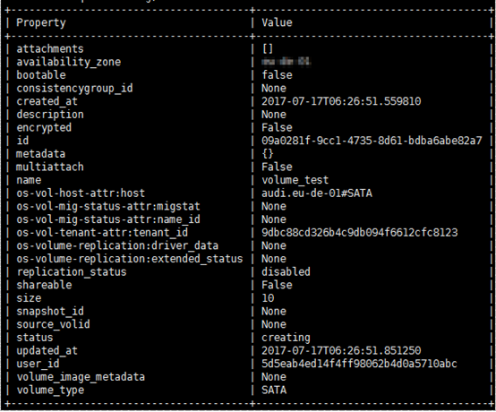
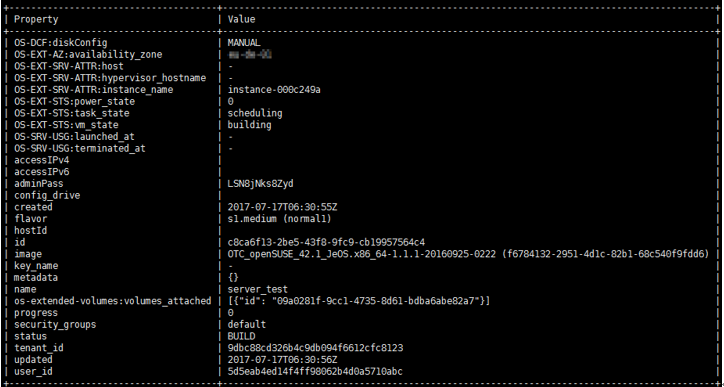

# 使用Individual CLI创建云服务器示例

## 创建Port

执行以下命令，创建Port。

**neutron** **port-create** **d5d7e451-cc4a-4c26-a4cf-6e94d56cbabd** **--name** **port\_test**

回显如下所示。

## 创建镜像磁盘

执行以下命令，创建镜像磁盘。

**cinder** **create** **--image-id** **f6784132-2951-4d1c-82b1-68c540f9fdd6** **--volume-type** **SATA** **--availability-zone** **aaa** **--name** **volume\_test** **10**

> **说明：**   
>命令中的“aaa”表示可用分区名称。  

回显如下所示。

## 创建云服务器

执行以下命令，创建云服务器。

**nova** **boot** **--boot-volume** **09a0281f-9cc1-4735-8d61-bdba6abe82a7** **--availability-zone** _**aaa**_ **--flavor** **normal1** **--nic** **port-id=c2f6726d-99aa-4719-a63d-6dd72a627134** **server\_test**

> **说明：**   
>命令中的“aaa”表示可用分区名称。  

回显如下所示。

