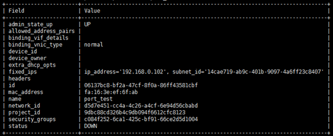
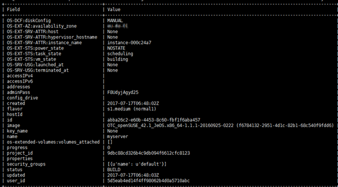

# 使用Unified CLI创建云服务器示例

## 创建Port

执行以下命令，创建Port。

**openstack** **port** **create** **port\_test** **--network** **d5d7e451-cc4a-4c26-a4cf-6e94d56cbabd**

## 创建云服务器

执行以下命令，创建云服务器。

**openstack** **server** **create** **--image** **f6784132-2951-4d1c-82b1-68c540f9fdd6** **--flavor** **normal1** **--availability-zone** **_aaa_** **--nic** **port-id=06137bc8-bf2a-47cf-8f0a-86ff43581cbf** **myserver**

> **说明：**   
>命令中的“aaa”表示可用分区名称。  

回显如下所示。

